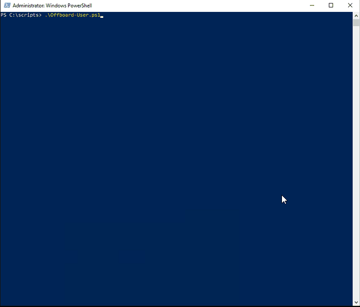

# domain-user-acct-mgmt
User account management scripts for AD and AAD

## Offboard-User.ps1
### An simple Powershell-based method for disabling user accounts
Prerequisites to run Offboard-User.ps1:
1. Download the Offboard-User.ps1 script and save to the AD server that also has ADSync installed.
2. Ensure you have the following modules installed, you may be prompted to install during the first run if you don't have them installed:
    - AzureAD
    - ExchangeOnlineManagement
    - ADSync
    - ActiveDirectory
3. Ensure you have WMF 5.1 installed. This will require a reboot if not already installed.

Steps to run:
1. Open Powershell as a user that has permission to make changes to ActiveDirectory and initiate a sync to AzureAD.
2. Change your directory to wherever the script is saved, for example the desktop of the user you're logged in as: `cd $env:userprofile\Desktop` or another example, `C:\Scripts\domain-user-acct-mgmt` would be: `cd C:\Scripts\domain-user-acct-mgmt`
3. Launch the script with the following command: `.\Offboard-User.ps1`
4. If you didn't satisify the prerequisites above, you may be prompted to install some additional modules and restart the script.
5. The first page you should see assuming prerequisites are satisfied should be a **Search for user by** page where you can enter the number of how you'd like to query for the user to disable.
6. You'll be prompted to search by whichever option you selected. Enter a query and we'll return a list of users that match your criteria. If only 1 user matches, then we'll confirm we're thinking of the same user.
7. Once confirmed, we'll disable the user, change passwords, remove from groups except for the users' primary and if ADSync is configured for group based sync, we'll exclude that as well. An ADSync cycle will be kicked off as well.
8. Next, you'll be prompted to select the Office 365/Azure AD environment - select Commerical unless you are confident you need to connect to another environment. If you need another environment, please create an issue so it can be added.
9. Sign in with AzureAD/Office 365 credentials.
10. You should see that the user will be removed from Exchange Online only distribution groups, mailbox converted to a shared mailbox, AAD tokens are revoked, and licenses are removed from the user.
11. Once completed, you should get a list of licenses that can be reclaimed.

